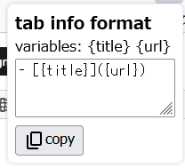

# Copy Titles
Copy Titles is Browser Addon to copy all tab titles and URLs.
You can configure output text format with {title} and {url}
to fit any text format.

# How to use
1. Install Copy Titles addon to your browser.
2. Click addon icon.
3. Set format and click Copy button.
4. Use clipboard.

# Notice
Copy icon is from [Material Icons](https://fonts.google.com/icons) by Google.
